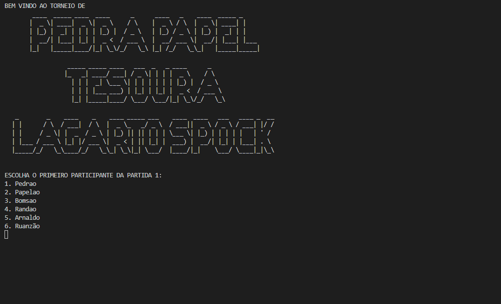
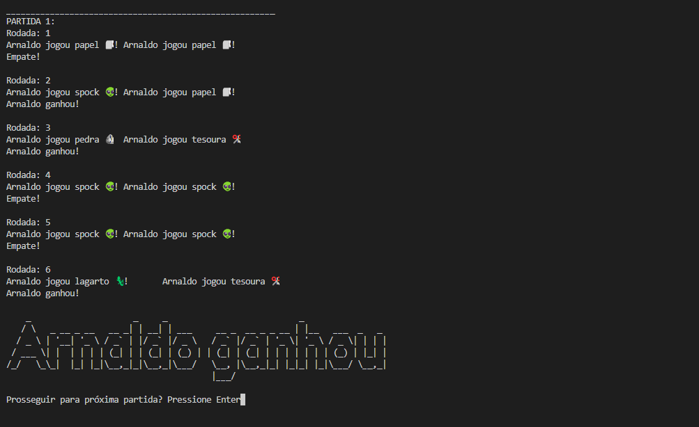
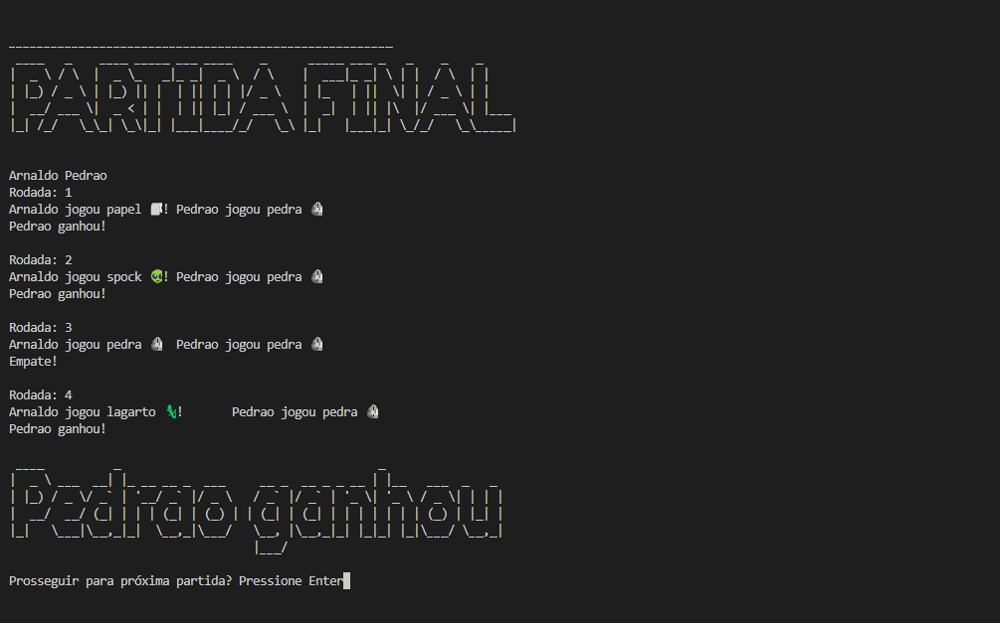

# Pedra Papel Tesoura Lagarto Spock

**Disciplina**: FGA0210 - PARADIGMAS DE PROGRAMAÇÃO - T01 <br>
**Nro do Grupo**: G1<br>
**Paradigma**: SMA<br>

## Alunos
|Matrícula | Aluno |
| -- | -- |
| 18/0012002 |  Álvaro Gouvea |
| 19/0044799 |  Antônio Ferreira de Castro Neto |
| 19/0042419 |  Davi Matheus da Rocha de Oliveira |
| 17/0142329 |  Francisco Emanoel Ferreira |
| 19/0014032 |  Guilherme Rogelin Vial |
| 18/0022237 |  Liverson Furtado Severo |
| 14/0155350 |  Matheus Filipe Faria Alves de Andrade |
| 19/0058650 |  Natanael Fernandes Coelho Filho |

## Sobre 
O jogo Pedra, Papel, Tesoura, Lagarto, Spock! é uma aplicação de Sistemas Multiagentes no qual é simulado um torneio de Pedra, Papel e Tesoura num estilo diferente.

Existem 6 tipos de Agentes (players), com um Model e a Simulação que consiste nas partidas 1 e 2, e depois a grande final. Dentre os 6 jogadores, o usuário escolhe 4 para preencher as partidas 1 e 2, cada jogador com um modelo de jogo diferente:

- Pedrão: apenas joga pedra.
- Papelão: apenas joga papel.
- Randão: joga de forma randômica.
- Bomsão: se adapta de acordo com as partidas anteriores.
- Arnaldo: tem maiores chances de vencer apenas 1 partida.
- Ruanzão: tem maiores chances de perder todas as partidas.


O jogo em questão foi inspirado na série The Big Bang Theory: o contexto pode ser compreendido com esse [vídeo](https://youtu.be/7QiiFEbGYnQ?t=86)

## Screenshots
## Menu Inicial


## Primeira partida


## Partida final e o vencedor


## Instalação 
**Linguagens**: Python<br>
**Tecnologias**: Mesa<br>
Utilizamos um Makefile para auxiliar na execução da aplicação.

Para instalar as dependências:

```make build```

Para rodar a aplicação:

```make run```

## Uso 

As regras do jogo vão um pouco além do Pedra, Papel, Tesoura convecional:

```
- Tesoura corta papel
- Papel cobre pedra
- Pedra esmaga lagarto
- Lagarto envenena Spock
- Spock esmaga (ou derrete) tesoura
- Tesoura decapita lagarto
- Lagarto come papel
- Papel refuta Spock
- Spock vaporiza pedra
- Pedra amassa tesoura
```

1 - Escolha 4 dos 6 jogadores para jogar a primeira e segunda partida.

2 - Veja as rodadas e vencedor da primeira e segunda partida.

3 - Veja as rodadas e vencedor da partida final e o vencedor.

## Vídeo
Adicione 1 ou mais vídeos com a execução do projeto.
Procure: 
(i) Introduzir o projeto;
(ii) Mostrar passo a passo o código, explicando-o, e deixando claro o que é de terceiros, e o que é contribuição real da equipe;
(iii) Apresentar particularidades do Paradigma, da Linguagem, e das Tecnologias, e
(iV) Apresentar lições aprendidas, contribuições, pendências, e ideias para trabalhos futuros.
OBS: TODOS DEVEM PARTICIPAR, CONFERINDO PONTOS DE VISTA.
TEMPO: +/- 15min

## Participações
## Participações
| Nome do Membro                           | Contribuição                                         | Significância da Contribuição para o Projeto (Excelente/Boa/Regular/Ruim/Nula) |
| ---------------------------------------- | ---------------------------------------------------- | ------------------------------------------------------------------------------ |
| Álvaro Gouveia -18/0012002		                                   | Auxílio Criação dos Agentes Iniciais / Sistema de Chaveamento | Excelente | 
| Antônio Ferreira de Castro Neto - 19/0044799|  - | Excelente                                                                            |
| Davi Matheus da Rocha de Oliveira - 19/0042419	         |   -  | Excelente                                                                            |
| Francisco Emanoel Ferreira   - 17/0142329	              |    |  |
|Guilherme Rogelin Vial	- 19/0014032	    |    |   |
| Liverson Furtado Severo	- 18/0022237    | - | Excelente                                                                         |
| Matheus Filipe Faria Alves de Andrade	- 14/0155350	 |  Auxílio criação dos agentes / Correção bugs   |  Excelente   |
| Natanael Fernandes Coelho Filho	- 19/0058650	                 |     |            |

## Outros 
Quaisquer outras informações sobre o projeto podem ser descritas aqui. Não esqueça, entretanto, de informar sobre:
(i) Lições Aprendidas;
(ii) Percepções;
(iii) Contribuições e Fragilidades, e
(iV) Trabalhos Futuros.

## Fontes
- [Regras do jogo](https://pt.wikipedia.org/wiki/Pedra-papel-tesoura-lagarto-Spock)

- [Mesa](https://mesa.readthedocs.io/en/stable/)
